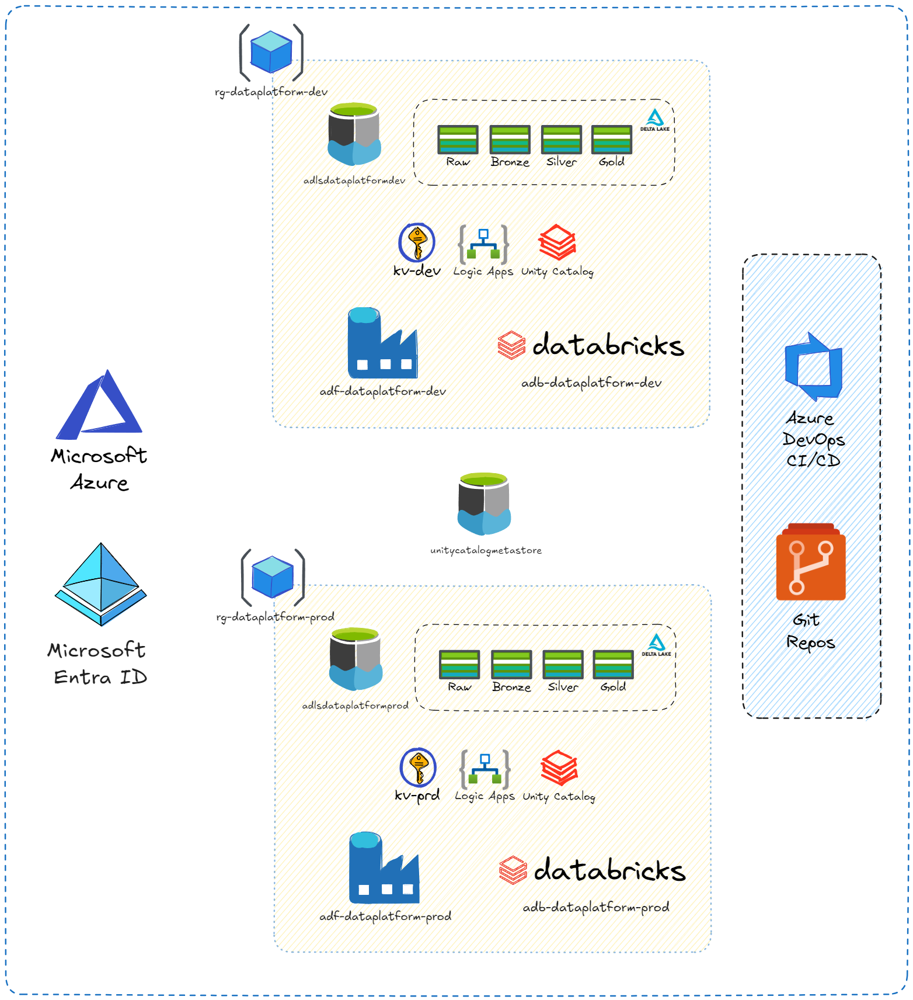
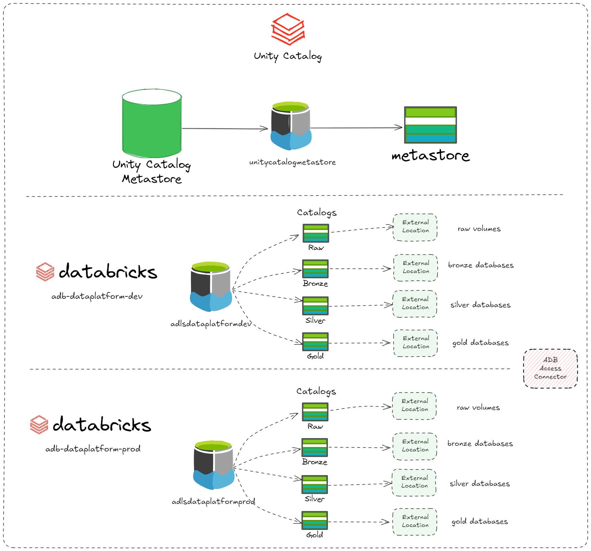

# Data Lakehouse na Azure

## Construção de um Data Lakehouse do ZERO na Azure

Nesse projeto, vou construir um Data Lakehouse completo utilizando a nuvem da azure.
O intuito desse projeto é construir todo projeto utilizando as melhores práticas de arquitetura, DevOps e também de código.

Para isso, será utilizada a seguinte estrutura:

Também utilizando o Unity Catalog do Databricks para governança, gestão de acessos, linhagem de dados e muito mais!

No decorrer do projeto, irei atualizando essa página.
